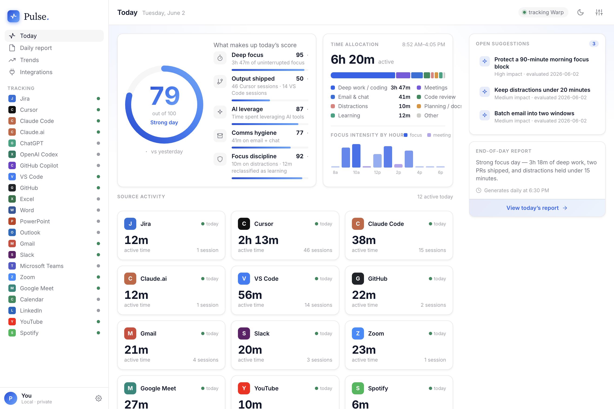

# Pulse — Productivity OS

A local-first macOS desktop app that quietly tracks what you do, computes a daily 0–100 productivity score, and uses Claude to generate end-of-day reports + measurable suggestions — then checks whether you actually acted on those suggestions the next day.

Everything is stored in a local SQLite file. No data leaves your machine except the AI report request itself.



> **The Today view** — a live 0–100 productivity score broken into five components, time allocation by category, per-source activity, an hourly focus strip, and Claude's end-of-day report with measurable suggestions. *(Shown with representative demo data, not real activity.)*

## Stack

- **Electron** + **Vite** + **React** + **TypeScript** — desktop shell + UI
- **better-sqlite3** — local persistence (events, daily reports, suggestions, monthly rollups)
- **active-win** — macOS foreground-window polling
- **node-cron** — daily/monthly scheduling
- **@anthropic-ai/sdk** — Claude Sonnet 4.6 for reports and suggestions
- Electron `safeStorage` (macOS Keychain) — API key storage

## Quick start

```bash
npm install         # installs Electron + native deps (rebuilds better-sqlite3 for the Electron Node ABI)
npm run dev         # launches Pulse in dev mode with hot reload
```

On first launch the Settings panel pops up. Paste an `sk-ant-…` key (get one at console.anthropic.com), pick a model, and close the panel. Pulse starts tracking immediately.

macOS will ask for **Accessibility** + optionally **Screen Recording** permission so `active-win` can read foreground window titles. Approve both for full fidelity, or turn off "Capture window titles" in Settings for a privacy-only mode (app names only).

## How the loop works

1. **Tracker** (main process) polls the foreground window every 5s. When app, title, or idle state changes, it closes the previous event and writes a new row to SQLite. One row per app-switch ≈ ~200–600 rows per workday.
2. **Classifier** maps each event to one of 9 categories (deep work / meetings / comms / distractions / learning / etc.) and to a "source" widget (Cursor, Slack, GitHub, …). The mapping logic is in `src/main/classifier.ts` — open it, scan the rules, refine them for your specific apps.
3. **Score** (`src/main/score.ts`) reduces today's metrics into 5 weighted components (focus / output / leverage / comms / discipline) and a 0–100 number. Targets are reasonable defaults; tune them to your day.
4. **Daily report** fires at 18:30 local (configurable cron in Settings). It:
   - Evaluates yesterday's open suggestions against today's measurements → marks each `followed` / `partial` / `not_followed`.
   - Sends today's measured numbers to Claude → gets back a headline, 4–7 observations, and exactly 3 suggestions with structured machine-checkable targets.
   - Saves both to SQLite. Tomorrow's report does the same and the loop continues.
5. **Monthly report** fires at 09:00 on the 1st of each month, summarizing average score, best/worst day, and the % of suggestions you actually followed — that's the "are you improving?" number.

## Where to customize

Three files are the personality of the app — everything else is plumbing:

- `src/main/classifier.ts` — which apps count as deep work vs comms vs distractions
- `src/main/score.ts` — weights, targets, and component formulas
- `src/main/ai/daily-report.ts` — the system prompt that defines tone + JSON schema

Renderer (UI) tweaks live in `src/renderer/styles/tokens.css` and `App.tsx`.

## Privacy

- The SQLite database is at `~/Library/Application Support/Pulse/pulse.sqlite`. Delete it to forget everything.
- API key is encrypted via macOS Keychain — never written in plaintext.
- AI requests send your *aggregated daily numbers* (mins per category, top sources, score components). Window titles are never sent — only the derived classifications.

## Building a `.dmg`

```bash
npm run package:mac     # produces a signed-ready Pulse.dmg under dist/
```

(Code signing requires an Apple Developer cert — out of scope for the dev workflow.)

## License

Licensed under the [Apache License 2.0](LICENSE). © 2026 Siddharth Chauhan.

You're free to use, modify, and distribute this software under the terms of the license, which also includes an explicit patent grant. See the [LICENSE](LICENSE) file for the full text.
